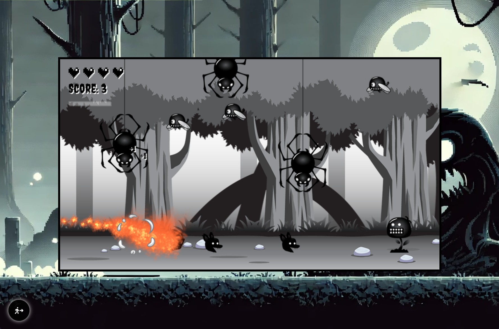

# 🌑 Shadowhound  

  

**Shadowhound** is an immersive side-scrolling, jump-and-run adventure game where players control a small black dog navigating a dark, mysterious forest. Defeat monsters with special abilities, earn points, and explore a world crafted in an atmospheric monochrome palette of black, gray, and white.  

  

---  

## 📖 Table of Contents  

- [🌟 Features](#-features)  
- [🎮 Gameplay](#-gameplay)  
- [🚀 Getting Started](#-getting-started)  
- [🎛️ Controls](#-controls)  
- [💻 Development](#-development)  
- [⚠️ Missing Features (WIP)](#-missing-features-wip)  
- [📜 License](#-license)  

---  

## 🌟 Features  

- **🖤 Atmospheric Setting**: A shadowy forest rendered in black, gray, and white, immersing players in an eerie, mysterious environment.  
- **⚔️ Endboss**: Challenge the epic final boss in the latest update!  
- **🔍 Debug Mode**: Toggle hitboxes, FPS, and other debug details to assist in development.  
- **🖥️ Fullscreen Mode**: Play in fullscreen for a more immersive experience.  
- **📱 Mobile Compatibility**: Optimized for both desktop and mobile; mobile users can jump and play with simplified controls.  

---  

## 🎮 Gameplay  

Take control of **Shadowhound**, a small, agile black dog braving the shadows of a dark forest. Avoid obstacles, battle enemies, and earn points as you progress through increasingly challenging levels. Your goal? Master the shadows and aim for a high score!  

  

---  

## 🚀 Getting Started  

To try **Shadowhound** locally:  

1. **Clone this repository**:  
   ```bash  
   git clone https://github.com/mariokreitz/Shadowhound.git  
   ```  
2. **Navigate to the project folder**:  
   ```bash  
   cd Shadowhound  
   ```  
3. **Install dependencies**:  
   ```bash  
   npm install  
   ```  
4. **Start the development server**:  
   ```bash  
   npm run dev  
   ```  
5. **Open the project** in your browser:  
   - The game should now be running locally on `http://localhost:5173`.  

---  

## 🎛️ Controls  

- **Move Left**: `←` (Left Arrow)  
- **Move Right**: `→` (Right Arrow)  
- **Move Up**: `↑` (Up Arrow)  
- **Move Down**: `↓` (Down Arrow)  
- **Special Move**: `Enter`  
- **Debug Mode**: `D`  
- **Fullscreen Mode**: `F`  

---  

## 💻 Development  

Shadowhound is developed with:  

- **Vite** for fast build and development environment.  
- **TypeScript, HTML, CSS** for core game mechanics.  
- **Canvas API** for graphics rendering.  
- **Git & GitHub** for version control.  

### Structure  

- **Assets**: Houses images for the player, enemies, and background.  
- **Classes**: Contains TypeScript classes for game components like player, enemy, background, and input handling.  
- **State Management**: Includes files for managing player states using the state design pattern, inspired by DoFactory's design pattern resources.  

---  

## ⚠️ Missing Features (WIP)  

### ✅ Completed:  

- **Landing Page**: The basic structure is set up!  
- **Menu**: Fully implemented and functional!  
- **Sounds & Effects**: Basic background music and click sounds are implemented.  
- **Mobile View & Controls**: Mobile compatibility and controls are now fully working.  
- **Endboss**: The final boss is now available and ready to challenge players.  

### 🔧 Still to Come:  

- **Advanced Settings**: More settings, such as difficulty levels, will be added in future updates.  

---  

## 📜 Documentation  

For detailed documentation and guides, visit the official **[Shadowhound Docs](https://shadowhound.mario-kreitz.dev/docs/)**.  

---  

## 📜 License  

This project is open-source and available under the MIT License. See the [LICENSE](LICENSE) file for more details.  

---  

Enjoy exploring the shadows in **Shadowhound**! 🌲🐾 
